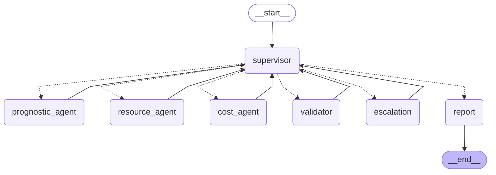

# LangGraph Multi-Agent Predictive Maintenance Graph

```mermaid
---
config:
  flowchart:
    curve: linear
---
graph TD;
	__start__([<p>__start__</p>]):::first
	supervisor(supervisor)
	prognostic_agent(prognostic_agent)
	resource_agent(resource_agent)
	cost_agent(cost_agent)
	validator(validator)
	escalation(escalation)
	report(report)
	__end__([<p>__end__</p>]):::last
	__start__ --> supervisor;
	cost_agent --> supervisor;
	escalation --> supervisor;
	prognostic_agent --> supervisor;
	resource_agent --> supervisor;
	supervisor -.-> cost_agent;
	supervisor -.-> escalation;
	supervisor -.-> prognostic_agent;
	supervisor -.-> report;
	supervisor -.-> resource_agent;
	supervisor -.-> validator;
	validator --> supervisor;
	report --> __end__;
	classDef default fill:#f2f0ff,line-height:1.2
	classDef first fill-opacity:0
	classDef last fill:#bfb6fc

```
